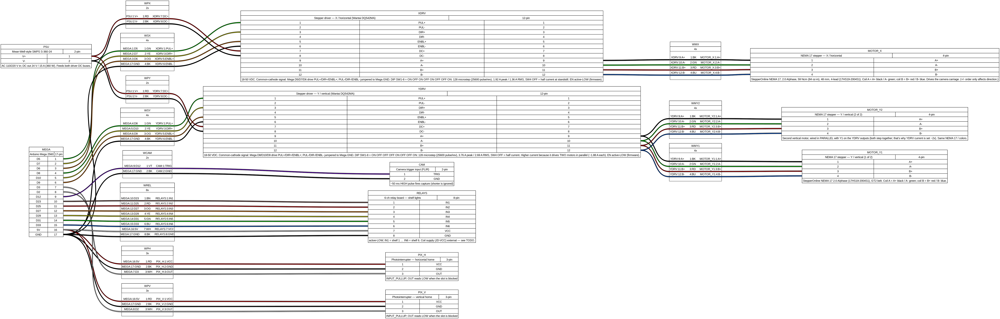

# wiring-diagrams

Wiring diagram for the **example Rhizodynamics / GROOT root-imaging robot** built as the
reference rig. It is the hardware companion to
[robot-control](https://github.com/the-rhizodynamics-robot/robot-control) — it shows how the
Arduino Mega 2560, stepper drivers, photointerrupters, camera trigger, and shelf-light
relays are connected, matching the pin map the firmware expects.



> ⚠️ **This documents one specific reference build.** Pin assignments are what the firmware
> drives; the parts and wire colors are what's on the example robot. Adapt for your own
> hardware. The authoritative pin map lives in robot-control's firmware.

## Source & rendering

The diagram is **generated from [`wiring.yml`](wiring.yml)** with
[WireViz](https://github.com/wireviz/WireViz) — a text source so the wiring diffs cleanly in
git, not a binary CAD file. Edit `wiring.yml`, then regenerate:

```bash
pip install wireviz          # needs Graphviz `dot` on PATH (apt install graphviz)
wireviz wiring.yml           # -> wiring.svg, wiring.png, wiring.bom.tsv (+ .html)
```

Committed outputs: [`wiring.svg`](wiring.svg) (vector), `wiring.png` (embedded above), and
the bill of materials [`wiring.bom.tsv`](wiring.bom.tsv). The `.html`/`.gv` intermediates
are git-ignored — regenerate them locally.

## Pin map (Mega 2560)

Encoded in `wiring.yml`; mirrors `robot-control` (the firmware is the source of truth — keep
this in sync with that repo). Stepper `enable` and the shelf-light relays are **active-LOW**.

| Function | Pin(s) | Notes |
|---|---|---|
| Horizontal motor (X) step / dir / enable | 5 / 7 / 6 | enable active-LOW |
| Vertical motor (Y) step / dir / enable | 8 / 10 / 9 | enable active-LOW |
| Horizontal photointerrupter | D3 | `INPUT_PULLUP`, reads LOW when triggered |
| Vertical photointerrupter | D2 | `INPUT_PULLUP`, reads LOW when triggered |
| Camera trigger | D12 | ~50 ms HIGH pulse |
| Shelf light relays | 23, 25, 27, 29, 31, 33 | index 0 = shelf 1, active-LOW |

Directions: right = LOW, left = HIGH, up = LOW, down = HIGH.

## Power wiring

`wiring.yml` now models the **stepper power subsystem** as built: an **S-360-24** 24 V / 15 A
PSU feeds both **Wantai DQ542MA** drivers, which drive **StepperOnline NEMA 17** motors (X =
one motor, Y = two in parallel). The 24 V LED shelf lights are switched by the relay board off
the same bus.

**Fusing (per branch, on the +24 V leg, near the PSU):** nothing downstream of the PSU is
internally fused, so each +24 V branch gets an **inline fast-blow** fuse — **X driver 5 A**,
**Y driver 7.5 A** (two motors), and the **LED branch** sized to the LED load. Values are
upsized so the drivers' cap-inrush doesn't nuisance-trip; a hard short still clears off the
15 A PSU. Returns (V−) are unfused. The AC side is left to the building breaker + the PSU's
onboard fuse. See the wiki's `hardware-open-questions.md` for the full rationale.

Still **build-specific TODO**:

- **5 V logic source** for the Mega, sensors, and the relay board's logic side.
- Relay **coil supply (JD-VCC)** and its ground — if powered separately, drop the
  `VCC`-from-Mega link in `wiring.yml`.
- **LED load wattage** (sets the LED-branch fuse) and the per-shelf contact wiring (the
  diagram shows one representative switched string).

## Related repos

- [robot-control](https://github.com/the-rhizodynamics-robot/robot-control) — firmware +
  Python host that drive this hardware.
- [file-sorting](https://github.com/the-rhizodynamics-robot/file-sorting) — processes the
  captured images.

## License

MIT — see [LICENSE](LICENSE).
